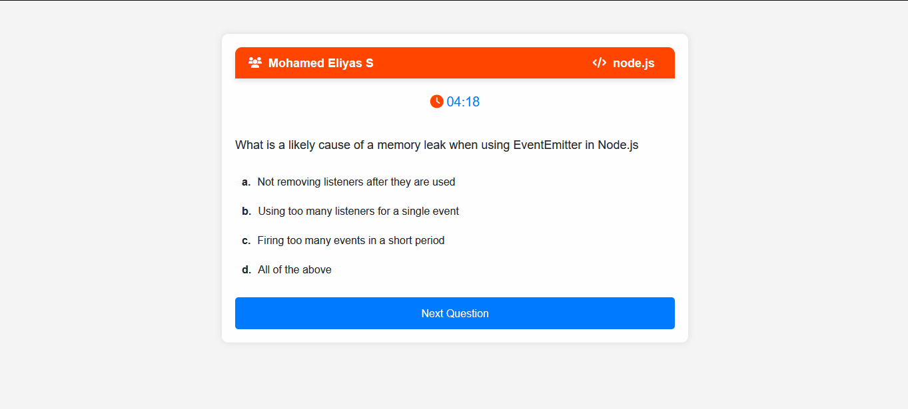

# Simple Game using HTML, CSS, JS & Node.js
- Simple Quiz game for the basic knowledge in coding
- technologies - HTML, CSS, JS & Node.js

##  Run Seperately Frontend & Backend

## Frontend Steps

- Download the source
- run Npm Install
- run make sure you have nodemon
- run nodemon server.js

##  Frontend pages

##  Dashboard

- admin dashboard for the game

##  After Game Start

##  Player View

##  After Game Start Player View

##  Result

## Backend Steps

- Download the source
- run Npm Install
- run make sure you have nodemon
- run nodemon index.js

##  Backend API's

##  Questions

##  Getting the user details

##  Leaderboard

